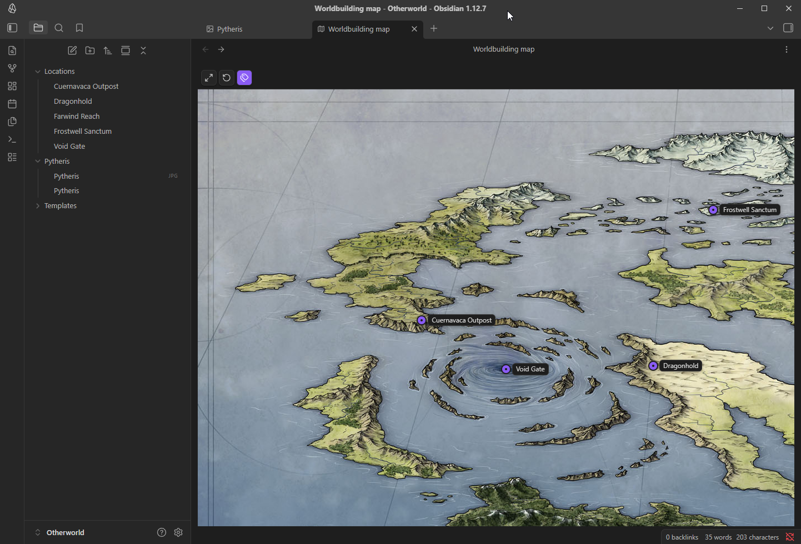
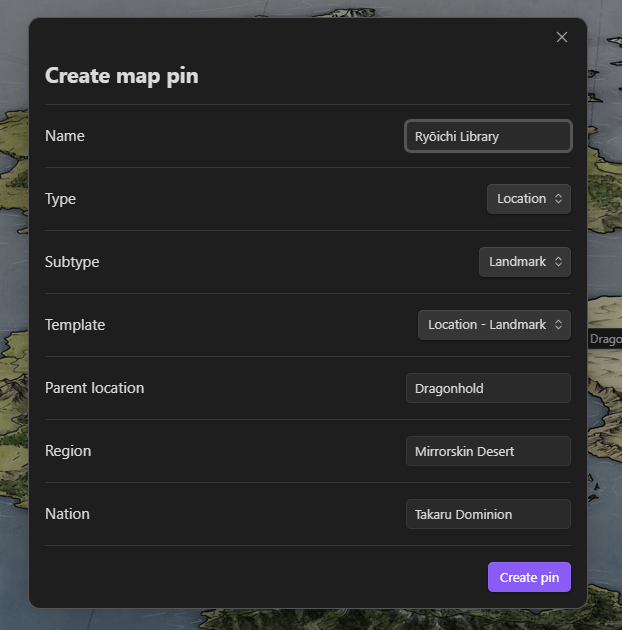
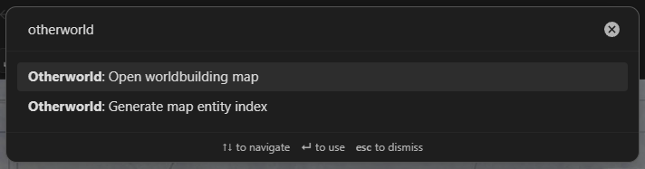

# Otherworld

Otherworld is an Obsidian desktop plugin for building interactive world maps from normal vault files.

It treats a folder, an image, and a markdown note as one map. The map opens in a custom view where you can pan, zoom, add pins, link pins to notes, edit pin metadata, and generate a markdown index from mapped entities.

When you create a pin, the plugin automatically creates the note for that pin. If there is a configured Templates folder with a matching template type (for example `Location - City` for a corresponding Location - City pin), that template is automatically applied to the note.

## Status

Otherworld is in active development. It is usable for local testing, but keep normal vault backups while the plugin is still settling.

The plugin stores data in markdown and YAML frontmatter. It does not use Obsidian Canvas, does not keep a separate database, and does not call a remote service.

## Screenshots

### Map View



### Pin Creation



### Command Palette



Map image attribution: the screenshots use a CC BY-NC-SA map image by Jonathan Roberts from Fantastic Maps, ["Free World Map"](http://www.fantasticmaps.com/2015/02/free-world-map/).

## What It Does

- Detects map folders by convention.
- Opens maps in an interactive Obsidian view.
- Supports drag panning, wheel or trackpad zoom, fit-to-view, reset zoom, and pin label toggling.
- Creates pins by double clicking the map.
- Stores pin positions as normalized image coordinates.
- Creates linked markdown notes for locations, events, people, factions, and items.
- Applies YAML frontmatter and optional Obsidian template content to new entity notes.
- Edits pin metadata from the map view.
- Opens, reveals, or copies the wikilink for a pin's linked note.
- Generates a markdown entity index for the current map.

## Quick Start

1. Create a map folder in your vault.
2. Add a same-name image file and markdown note.
3. Run **Open worldbuilding map** from the command palette.
4. Double click the map to create a pin.
5. Run **Generate map entity index** when you want a markdown index of mapped entities.

Example vault structure:

```text
World/
  World.png
  World.md
```

Supported image extensions are `png`, `jpg`, `jpeg`, `webp`, and `gif`.

The map note stores map metadata in frontmatter:

```markdown
---
worldbuildingMap:
  image: World.png
  coordinateSystem: normalizedImage
  pins: []
---

# World
```

Pin coordinates are stored from `0` to `1` relative to the source image. This keeps pins stable if the image is displayed at a different size.

## Opening Maps

Map discovery starts from the active file or folder and searches upward until it finds a matching map folder. You can also right click a file or folder inside a detected map and select **Open worldbuilding map**.

If **Automatically create map note when opening matching map image** is enabled in settings, opening a same-name map image can create the missing map note.

## Map Controls

- Drag empty map space to pan.
- Scroll or use a trackpad gesture to zoom around the pointer.
- Select **Fit map to view** to fit the image inside the visible map area.
- Select **Reset map zoom** to return to the default zoom.
- Select the label toggle to show or hide pin labels.

## Pins and Notes

Double click inside the map image to create a pin. The create pin modal collects the pin name, type, subtype, target folder, description, and location hierarchy fields when the pin is a location.

Pin types:

- `location`
- `event`
- `person`
- `faction`
- `item`

Clicking a pin opens its linked note. Command click on macOS, or Control click on Windows and Linux, opens the edit pin modal. Right click a pin to edit it, open its note, reveal its note, or copy its wikilink.

Location pins can use hierarchy metadata:

```yaml
parentLocation: "[[Northern Marches]]"
region: "[[Northern Marches]]"
nation: "[[Valoria]]"
```

Entity notes created from pins include frontmatter that links them back to the source map and pin.

## Templates

Otherworld uses Obsidian's configured Templates folder when the core Templates plugin is enabled and configured. If a templates folder is available, the create pin modal shows template choices. If not, Otherworld uses a built-in fallback note body.

Templates are only applied when creating a new entity note. Existing notes are not overwritten with template content.

Supported template tokens:

- `{{name}}`
- `{{type}}`
- `{{subtype}}`
- `{{map}}`
- `{{mapPath}}`
- `{{x}}`
- `{{y}}`
- `{{pinId}}`
- `{{parentLocation}}`
- `{{region}}`
- `{{nation}}`

## Entity Index

Run **Generate map entity index** to create or update an index note next to the map note. By default, the file is named `<Map Name> Index.md`.

The index groups pins by type. Location entries are organized hierarchically when their linked notes contain `parentLocation` metadata. The generator reports missing entity notes, unresolved parents, cycles, duplicate links, and unsupported pin types.

The index filename pattern can be changed in settings with `{{mapName}}`:

```text
{{mapName}} Atlas
```

## Settings

Open **Settings → Community plugins → Otherworld** to configure:

- Entity output folders by pin type.
- Default subtype by pin type.
- Whether pin labels are shown by default.
- Parent location creation behavior.
- Entity index filename pattern.
- Whether opening a matching map image creates a missing map note.

## Build Locally

Otherworld uses npm and esbuild.

Install dependencies:

```bash
npm install
```

Start a watch build for local development:

```bash
npm run dev
```

Create a production build:

```bash
npm run build
```

Run tests:

```bash
npm test
```

Run linting:

```bash
npm run lint
```

The build writes the Obsidian release files at the plugin root:

- `main.js`
- `manifest.json`
- `styles.css`

`main.js` is generated output. Do not edit it by hand.

## Local Installation

For development, the simplest setup is to keep this repository at:

```text
<Vault>/.obsidian/plugins/otherworld/
```

Then run:

```bash
npm install
npm run dev
```

Reload Obsidian and enable **Otherworld** in **Settings → Community plugins**.

For a manual build install:

1. Run `npm run build`.
2. Create `<Vault>/.obsidian/plugins/otherworld/`.
3. Copy `main.js`, `manifest.json`, and `styles.css` into that folder.
4. Reload Obsidian.
5. Enable **Otherworld** in **Settings → Community plugins**.

## Test Vault

The repository includes a small `test-vault/` fixture with a sample world folder, entity notes, and a full set of starter templates. The template files can be copied into a real Obsidian vault's Templates folder to bootstrap common Otherworld note types. It is useful for manual checks while developing, but automated tests are run through Vitest.

## File Safety Notes

- Pin and entity data stays in markdown/frontmatter.
- Pin positions are normalized coordinates, not screen pixels.
- Existing entity notes are linked instead of overwritten with template content.
- Generated entity indexes preserve manual content outside the generated sections.
